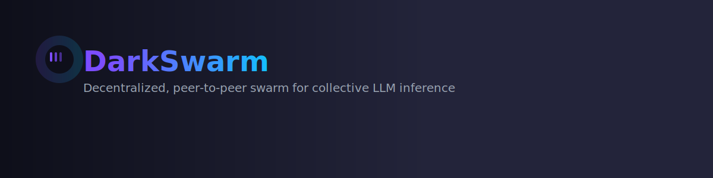
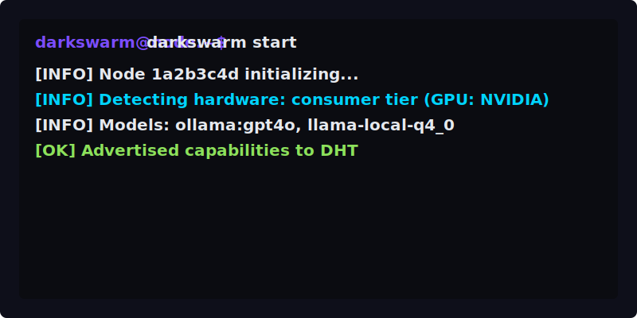

# DarkSwarm

  

**Decentralized, peer-to-peer swarm for collective LLM inference**

  

DarkSwarm is a **decentralized, peer-to-peer swarm for collective open-source LLM inference**. It turns consumer GPUs, edge devices, and servers into a distributed AI compute mesh — no central authority, self-hosted, and privacy-first.

> 🧠 **Self-hosted · Uncensored · P2P · Privacy-first · Self-improving**

---

(Original README content continues below)

